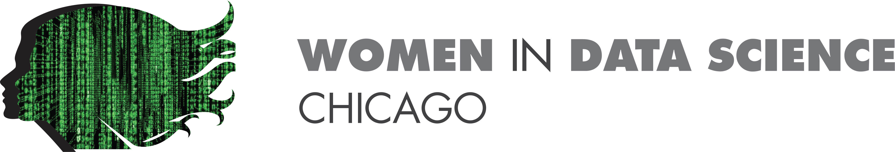

Thursday, March 5, 2020  
5:00 to 8:00 pm  
TGS Commons  

2122 Sheridan Road  
Evanston, IL 

Participants will be emailed the dataset on February 27, 2020 (one week before the event). They will have one week to load the dataset in R/Python and answer preliminary exploratory questions. At the data dive event, they will be given a question of interest from the Greater Chicago Red Cross. Teams will be selected to have their work presented at the downtown Chicago event , the following day, on March 6, 2020. 

