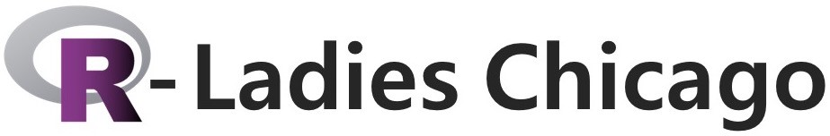

 

  

Thursday, September 26, 2019  
4:30 PM to 6:30 PM   
[Mudd Library](https://www.library.northwestern.edu/libraries-collections/mudd-library/)  
Dinner Provided  
Please [RSVP](meetup.com/rladies-chicago)  
  
*This event is co-sponsored by [R-Ladies Chicago](https://rladieschicago.org/) and WIST.*

## Speaker: [Leah Welty, Ph.D](https://www.feinberg.northwestern.edu/faculty-profiles/az/profile.html?xid=17279)  
Professor of Preventive Medicine (Biostatistics) and Psychiatry and Behavior Science and lead developer of StatTag at Northwestern 

## Want to automatically update your Word document with R outputs? Lear StatTag!  
This event will teach participants how to use [StatTag](https://sites.northwestern.edu/stattag/) 
(free, open source software) to create a bi-directional
connection between R/RMarkdown and a Word
document so that all files can be edited separately, but
statistical content – values, tables,
figures, etc., can be updated
automatically in Word.

#### Docuements
[Event Flyer](flyer.pdf)
