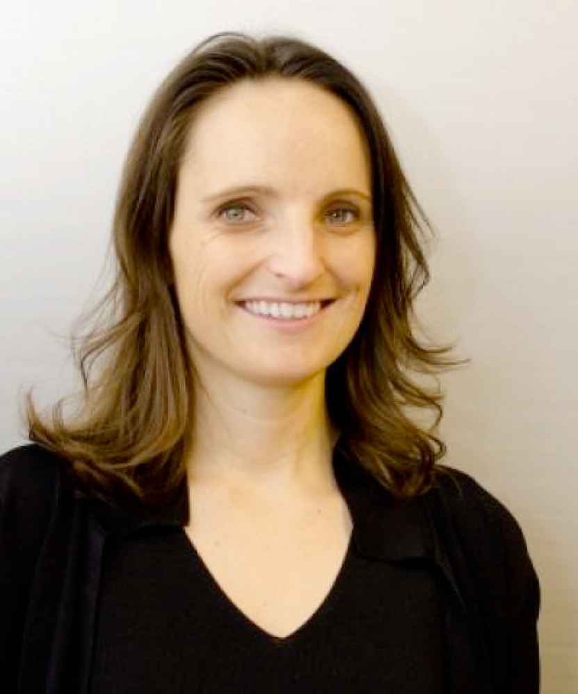

**Monday, November 9, 2020**  
**11:00 AM-12:30 PM CST via Zoom**  
Registration required to receive Zoom event link. Register at: 
https://northwestern.zoom.us/meeting/register/tJMpcOCtrjwuGdasU5RycUWzOUBVsG2KcXJA 

[**Elizabeth Mannshardt**](http://www2.stat.duke.edu/~es112/) will be hosting a virtual workshop on on: 

**"Navigating Your Professional Success": Career-Building Power Skills and Insights into Imposter Syndrome**
 

"Navigating Your Professional Success" includes considerations beyond developing expertise in statistical methodologies, with Power Skills such as building your brand, structuring your career goals, and networking and communication.  Combining experiences across industry, government, and academic research, we will discuss how to develop power skills using real-world examples with actionable and practical techniques. Each topic has a set of activities for participants - for immediate hands-on interaction as well as take-home reflection - based professional programs and materials developed for [NC ASA's Mentoring and Early Career Development Workshop](https://community.amstat.org/northcarolina/blogs/2018/careerdevelopmentworkshop).  Along with Power Skills, just as important to recognize and understand early in one’s career is the Imposter Syndrome.  Feel like a fraud with regards to your area of expertise, that others must know more than you do?  Think your accomplishments must be due to “luck”, or don’t deserve the accolades that they’ve received? The American Psychological Association says you are not alone. Imposter Syndrome, coined by clinical psychologist Pauline Clance and colleague Suzanne Imes, gives a name to what may often be felt by high-performing but inwardly anxious and self-doubting professionals. Imposter syndrome can lead to physical stress, premature burn-out, and other hinderances to professional success. We will identify symptoms and behaviors that you may recognize in yourself or in others. Techniques and strategies will be offered for navigating and overcoming Imposter Syndrome in your professional setting. This combined set of imposter syndrome considerations and power skills can serve as vital tools throughout one’s career.

This talk is open to all Northwestern and affiliated community members.

## About Elizabeth

Elizabeth Mannshardt is the Associate Director of the US Environmental Protection Agency’s "Data Science" Division (Information Access and Analytic Services Division). She is also an Adjunct Associate Professor in the Department of Statistics at North Carolina State University and actively serves on several Executive Boards within the American Statistical Association. Originally from California, she received her PhD in Statistics from UNC Chapel Hill. Prior to joining EPA, Elizabeth held two National Science Foundation Postdoctoral Fellowships in Environmental Statistics and was a Visiting Assistant Professor in the Department of Statistical Science at Duke University.

