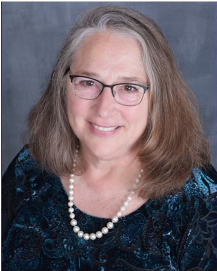
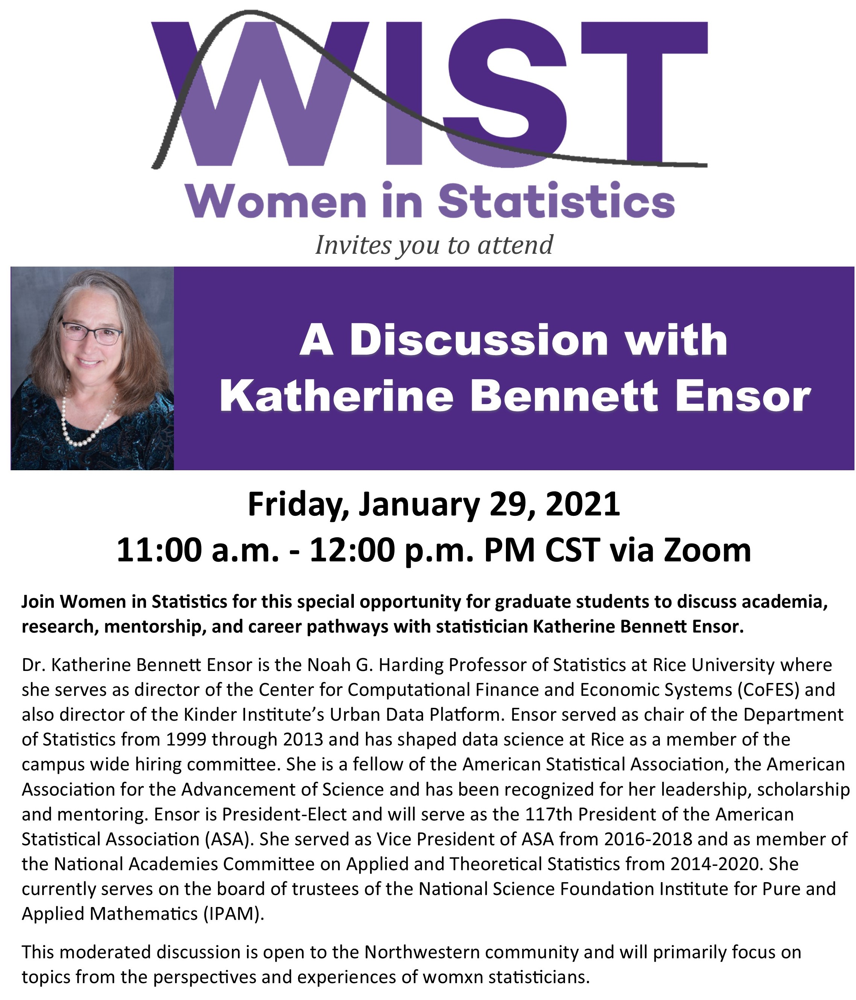

**Friday, January 29, 2021**  
**11:00 AM - 12:00 PM CST via Zoom**  
Registration required to receive Zoom event link. Register at: 
https://northwestern.zoom.us/meeting/register/tJUkdu6uqj4vHNeKOsBhINwu-jOZpU8Cl0q4

Join Women in Statistics for this special opportunity to discuss academia, research, mentorship, and career pathways with internationally recognized statistician Katherine Bennett Ensor.

This moderated discussion is open to all graduate students and will primarily focus on topics from the perspectives and experiences of womxn statisticians.

  
## About Katherine Bennett Ensor  
Dr. Katherine Bennett Ensor is the Noah G. Harding Professor of Statistics at Rice University where she serves as director of the Center for Computational Finance and Economic Systems (CoFES) and also director of the Kinder Institute’s Urban Data Platform. Ensor served as chair of the Department of Statistics from 1999 through 2013 and has shaped data science at Rice as a member of the campus wide hiring committee. She is a fellow of the American Statistical Association, the American Association for the Advancement of Science and has been recognized for her leadership, scholarship and mentoring. Ensor is President-Elect and will serve as the 117th President of the American Statistical Association (ASA). She served as Vice President of ASA from 2016-2018 and as member of the National Academies Committee on Applied and Theoretical Statistics from 2014-2020. She currently serves on the board of trustees of the National Science Foundation Institute for Pure and Applied Mathematics (IPAM).

