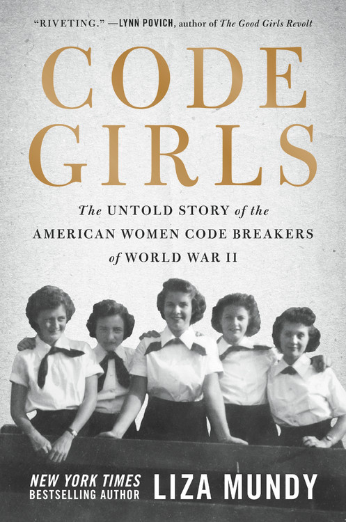

  

## Description from Cover   

Recruited by the U.S. Army and Navy from small towns and elite colleges, more than ten thousand women served as codebreakers during World War II. While their brothers and boyfriends took up arms, these women moved to Washington and learned the meticulous work of code-breaking. Their efforts shortened the war, saved countless lives, and gave them access to careers previously denied to them. A strict vow of secrecy nearly erased their efforts from history; now, through dazzling research and interviews with surviving code girls, bestselling author Liza Mundy brings to life this riveting and vital story of American courage, service, and scientific accomplishment.

## Book Details 
  |   
--|--  
Full Title | Code Girls: The Untold Story of the American Women Code Breakers of World War II  
Author | [Liza Mundy ](https://en.wikipedia.org/wiki/Liza_Mundy)
ISBN-10 | 0316439894 
ISBN-13 | 978-0316439893

