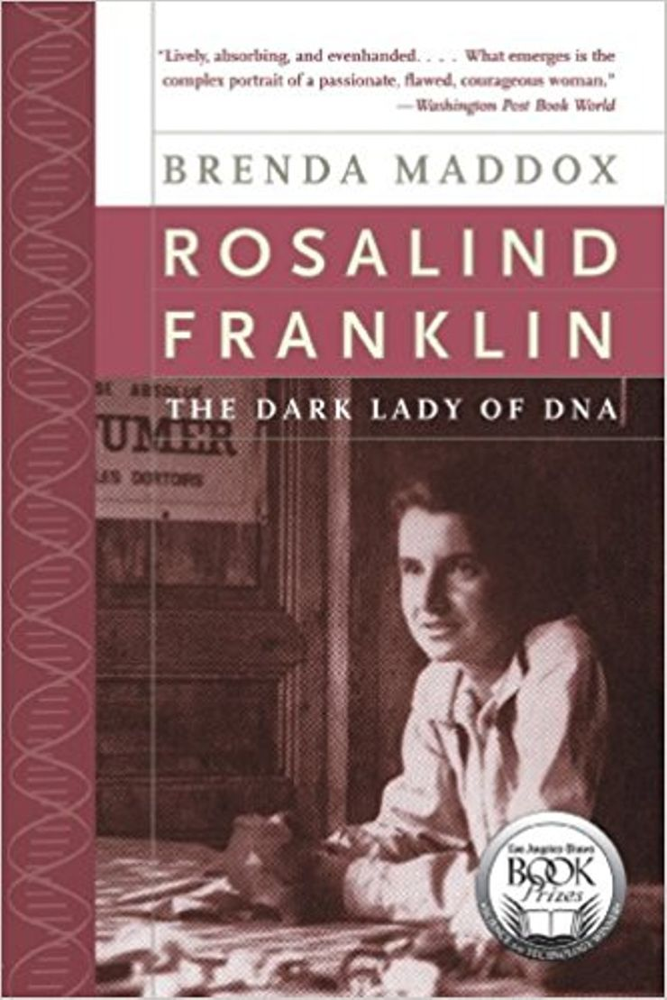

  

## Description from Cover   

In 1962, Maurice Wilkins, Francis Crick, and James Watson received the Nobel Prize, but it was Rosalind Franklin's data and photographs of DNA that led to their discovery.

Brenda Maddox tells a powerful story of a remarkably single-minded, forthright, and tempestuous young woman who, at the age of fifteen, decided she was going to be a scientist, but who was airbrushed out of the greatest scientific discovery of the twentieth century.

## Book Details 
  |   
--|--  
Full Title | Rosalind Franklin: The Dark Lady of DNA  
Author | [Brenda Maddox ](https://en.wikipedia.org/wiki/Brenda_Maddox)
ISBN-10 | 0060985089 
ISBN-13 | 978-0060985080
